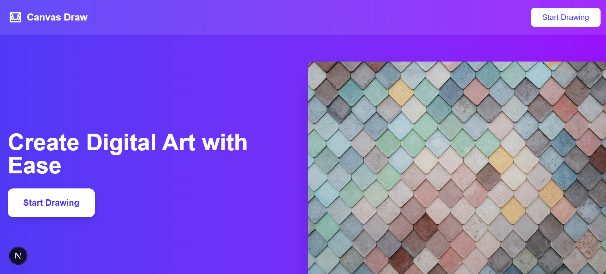
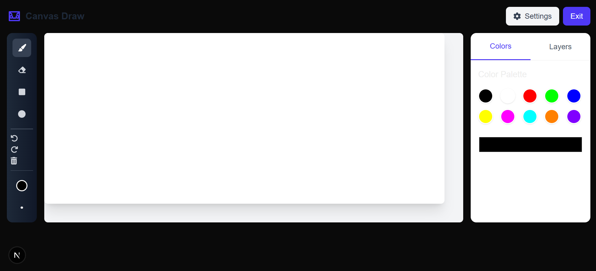

# CanvasDraw - Digital Art Studio 🎨

_Create Digital Art with Ease_

---

## Screenshots

  
  

---

A responsive web-based drawing application built with Next.js, TypeScript, and Tailwind CSS. Create digital artwork with multiple layers, undo/redo functionality, and various drawing tools.

## Features ✨

- 🖌️ **Multiple Drawing Tools**: Brush, eraser, rectangle, and circle
- 🎨 **Color Palette**: Predefined colors + custom color picker
- 🧩 **Layer System**: Add, delete, and manage multiple layers
- ⏪ **Undo/Redo**: Unlimited history for mistake correction
- 💾 **Export**: Save your artwork as PNG
- 📱 **Responsive Design**: Works on desktop and mobile devices
- ⚡ **Performance**: Optimized canvas rendering

---

## Tech Stack 🛠️

- **Framework**: [Next.js](https://nextjs.org/)
- **Language**: [TypeScript](https://www.typescriptlang.org/)
- **Styling**: [Tailwind CSS](https://tailwindcss.com/)
- **Icons**: [Font Awesome](https://fontawesome.com/)
- **State Management**: React Hooks

---
